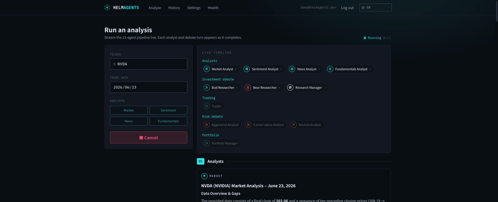
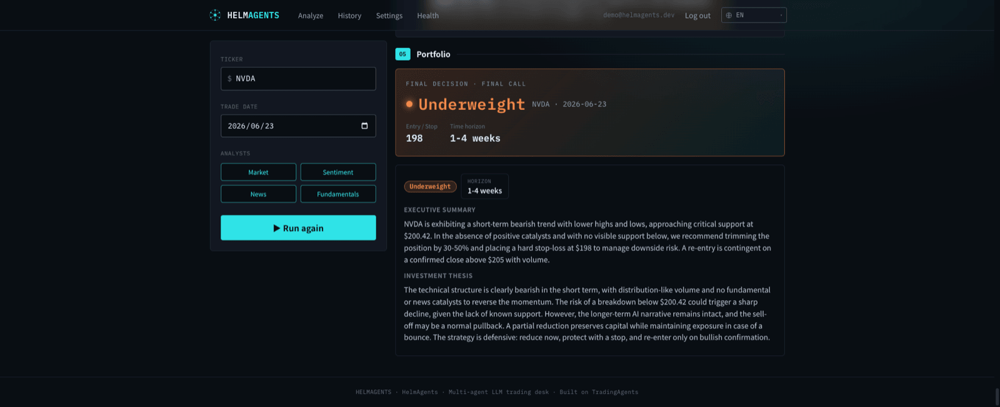
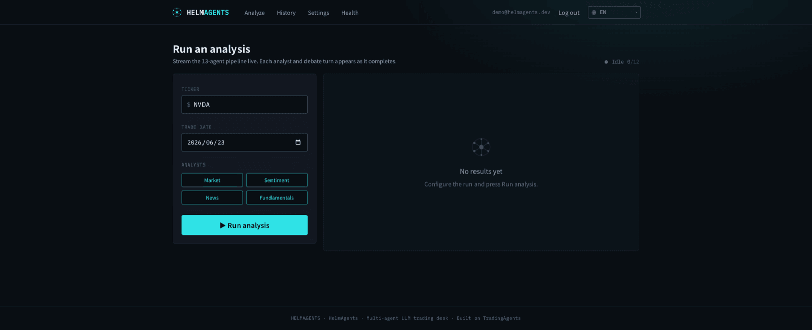
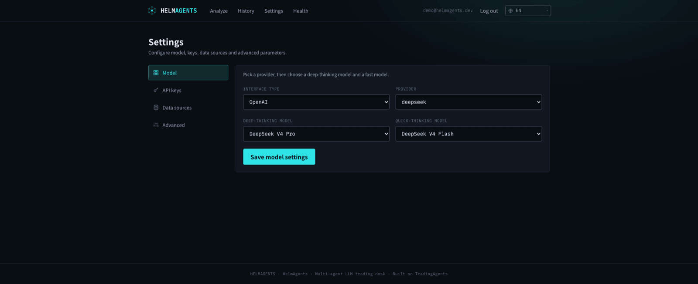

# HelmAgents

**[简体中文](README.md)** · [English](README.en.md) · [日本語](README.ja.md) · [한국어](README.ko.md) · [Français](README.fr.md) · [Deutsch](README.de.md) · [Español](README.es.md) · [Tiếng Việt](README.vi.md)

[](LICENSE)
[](package.json)
[](package.json)
[](https://nestjs.com)
[](https://vitejs.dev)

**多智能体 LLM 交易，由你掌舵。** 十三位 AI 分析师采集情报、多空辩论、风控压测，最终收敛成一个可追溯的交易决策——全程在浏览器中实时推演。

> 一个**独立**、TypeScript 原生的项目：以浏览器为先、全程可观察的交易台，构建于独立的 **NestJS API** + **React + Vite** SPA 之上——实时流式、可追溯、不绑定任何模型厂商。

<p align="center">
  
  <br><sub>实时流式时间线 —— 13 个智能体逐步完成，多空与风险辩论在浏览器中实时呈现</sub>
</p>

---

## 💸 交易代币化美股——20%+ 手续费返还

**把每个决策落地，并拿回 20%+ 的交易手续费。** 在 Binance / OKX / Gate 上用加密货币买入同样的美股（NVDA、AAPL……）的**代币化股票**——用我们的邀请码注册，**每笔交易后约 1 小时内，20%+ 的手续费会自动返还到你的交易所账户**：

| 交易所 | 邀请码 | 注册 |
|---|---|---|
| **Binance 币安** | `FANWO20` | <https://www.binance.com/join?ref=FANWO20> |
| **OKX 欧易** | `FANGEIWO` | <https://www.okx.com/join/FANGEIWO> |
| **Gate 芝麻开门** | `FANGEIWO` | <https://www.gate.io/share/FANGEIWO> |

> 手续费返佣由我们的赞助商 **[rebateto.me](https://rebateto.me/how_to_referral)** 提供。
> 完整说明、大陆镜像链接与领取方式 →
> [执行决策](#执行决策交易代币化美股20-手续费返还)。
> *推荐链接——对你无额外成本，并支持本项目。非投资建议；加密货币/代币化股票有风险。*

---

## 为什么做 HelmAgents？

HelmAgents 用 LLM 驱动的分析师、研究员、交易员、风控分析师与组合经理模拟一整家交易机构，让它们收敛出一个附带完整推理的五档交易决策。但它不止步于一个 CLI 研究脚本——它是一款真正的产品，**可观察、可分享、不绑定单一模型，且持续迭代变得更好**：

- **看见它的思考过程。** 实时流式时间线让每位分析师与每一回合辩论在完成时即呈现——不必再盯着终端等到结束。
- **无需 Python 环境。** NestJS API 托管引擎，React/Vite SPA 驱动它：在浏览器里配置、点一下按钮、读取决策。
- **自带模型即可。** 20 家 provider 注册表（OpenAI 兼容家族 + 原生 Anthropic/Google），不被单一厂商锁定。
- **决策可追溯、可复盘。** 每次运行都连同完整推理（分析师报告、多空与风险辩论、最终决策）一并持久化，并可导出为 Markdown。
- **落地决策，还能拿回手续费。** 同样的标的可在 Binance / OKX / Gate 以**代币化股票**交易，用邀请码 `FANWO20`（币安）或 `FANGEIWO`（OKX / Gate）注册，**每笔交易后约 1 小时内自动返还 20%+ 的手续费到账户**。详见 [执行决策](#执行决策交易代币化美股20-手续费返还)。
- **默认安全。** API 密钥落盘加密（AES-256-GCM）；运行数据只留在本机；不回传任何数据。

> ⚠️ **非投资建议。** HelmAgents 产出的分析仅供研究与教育用途，可能出错。请独立核实；交易与加密资产有风险，可能损失本金。

## 它做什么

给定 `(代码, 交易日期)`，一条 13 智能体流水线产出一个五档交易决策（**买入 / 增持 / 持有 / 减持 / 卖出**），附带完整支撑分析：

1. **分析师**——行情 · 情绪 · 新闻 · 基本面 采集数据。
2. **投资辩论**——看多 ⇄ 看空 研究员辩论；研究经理裁定为结构化投资计划。
3. **交易员**——把计划转化为带入场、止损、仓位的买入/持有/卖出提案。
4. **风险辩论**——激进 / 保守 / 中立 分析师对提案做压力测试。
5. **组合经理**——综合一切，作出最终决策。

<p align="center">
  
  <br><sub>组合经理的最终决策 —— 五档评级、入场/止损、周期与完整推理</sub>
</p>

## 工作原理

流水线以 LangGraph.js `StateGraph` 运行，并在每个智能体完成时把 `nodeEnd` 事件流式推送到浏览器。分析师内联预取数据（输出与原项目的工具调用循环等价，但省去额外往返），每份报告、辩论全文与最终决策都被捕获进运行状态。

## 架构

pnpm 单仓多包，**前后端分离**。引擎与全部业务逻辑都放在与框架无关的 package 里；NestJS API 负责托管它们，React/Vite SPA 通过 HTTP 与 API 通信（由共享的 contracts 包提供类型）。

```
apps/
  api           NestJS（ESM）—— 托管引擎；/api 前缀下的 REST 端点（含认证）
  web           React 19 + Vite SPA —— react-router、react-i18next（8 种语言）
packages/
  contracts     api ↔ web 共享的 HTTP DTO 类型（纯类型，无运行时代码）
  core          createEngine() / propagate() / streamEvents()  —— 唯一入口
  workflow      LangGraph.js StateGraph：拓扑 + 条件式辩论/风控路由
  agents        13 个智能体工厂（分析师/研究员/交易员/风控/经理）
  dataflows     数据源路由（routeToVendor）+ 错误层级 + yfinance
  llm           20 家 provider 注册表 + OpenAI 兼容客户端
  config        DEFAULT_CONFIG + 三层合并（env → 运行时）
  persistence   SQLite 存储（node:sqlite）—— 账户、认证令牌、按用户隔离的密钥/设置/运行/记忆
  shared        Zod schemas、AgentState、评级、代码工具
```

**数据流：** `apps/web`（SPA）→ HTTP `/api/*` → `apps/api`（NestJS）→
`core.propagate()` → `workflow.buildGraph()` →
`agents.*`（调用 `dataflows.routeToVendor`）+ `llm.createLlmClient`。运行时间线由 API 以 NDJSON 流式推送。

## 安装

提供两种一键安装方式。两者都以**正常模式**启动——启动后打开应用，**创建账户**（开放注册），再进入 **设置（Settings）**，选择 LLM 提供商并填入你的 API 密钥（按账户加密存储）。还没有密钥？见 [使用](#使用) 里的 DEMO 选项。需要 **Node ≥ 22**。

### 方式 A —— 本地一键脚本

需要 **Node.js ≥ 22**（pnpm 会经 corepack 自动启用）。

```bash
git clone <仓库地址>
cd tradingagents-web
./scripts/install.sh
```

脚本会安装依赖、构建全部，并启动 API（`:5171`）+ web SPA（`:5170`）。打开 **<http://localhost:5170>**。

### 方式 B —— Docker 一键

需要 **Docker**（含 Compose），无需 Node/pnpm。

```bash
git clone <仓库地址>
cd tradingagents-web
docker compose up --build
```

这会构建并运行两个容器——NestJS API，以及一个用 nginx 托管 SPA 并把 `/api` 反向代理到 API 的前端。打开 **<http://localhost:8080>**。运行记录、设置与加密密钥持久化在 `helmagents-store` 卷里。想免密钥试用，可在 `docker-compose.yml` 里给 `api` 服务设 `DEMO_LLM=1`。

> 开发用手动方式：`pnpm install` 然后 `pnpm dev`。若 `pnpm install` 提示忽略构建脚本（esbuild / msw / sharp / @swc/core），把 `pnpm-workspace.yaml` 中 `allowBuilds:` 下对应项设为 `true`，或运行 `pnpm approve-builds`。

## 使用

应用支持 **8 种语言**：`/en /zh /ja /ko /fr /de /es /vi`。裸路径 `/` 会重定向到 `/en`。

### 1. DEMO 模式——无需任何 API 密钥

```bash
DEMO_LLM=1 pnpm dev
```

`pnpm dev` 经由 Turbo **同时**启动两个 app：NestJS API 跑在 `http://localhost:5171`，Vite SPA 跑在 `http://localhost:5170`（dev server 会把 `/api` 代理到 API）。`DEMO_LLM=1` 用确定性 stub LLM 跑通**完整 13 智能体流水线**——流式、持久化、取消、反思全部真实运行，仅最终文本生成被 stub。适合演示、UI 调试与本地验证。

打开 `http://localhost:5170/zh`，进入 **/analyze**，配置并点 **开始分析**。

<p align="center">
  
  <br><sub>发起分析 —— 输入代码与交易日期、选择分析师，一键流式运行</sub>
</p>

### 2. 真实 LLM 模式

配置任一 provider 的 API 密钥——可在 `/settings`（落盘加密）或通过环境变量（见 [`.env.example`](.env.example)）：

```bash
export OPENAI_API_KEY=sk-...
# 可选覆盖
export TRADINGAGENTS_LLM_PROVIDER=openai
export TRADINGAGENTS_DEEP_THINK_LLM=gpt-5.5
export TRADINGAGENTS_QUICK_THINK_LLM=gpt-5.4-mini
pnpm dev
```

随后在 **/analyze** 运行分析。报告语言跟随 URL locale（如 `/zh/analyze` → 中文报告）。生产环境下 SPA 与 API 可分开部署——用 `VITE_API_BASE_URL` 把 SPA 指向 API 地址，用 `CORS_ORIGIN` 允许 SPA 的源（见 [`.env.example`](.env.example)）。

<p align="center">
  
  <br><sub>自带模型 —— 从 20+ provider 选择，深思 / 快思模型分别配置，密钥落盘加密</sub>
</p>

| 路径 | 功能 |
|---|---|
| `/<locale>` | 首页——流水线介绍 |
| `/<locale>/analyze` | 配置并**流式**运行分析 |
| `/<locale>/history` | 运行历史 |
| `/<locale>/runs/<id>` | 运行详情 + 导出 Markdown |
| `/<locale>/settings` | provider / 模型 / 数据源 / API 密钥 |

> 完整运行指南（DEMO 模式、真实 LLM、常见问题）：[`docs/RUNNING.md`](docs/RUNNING.md)

## 执行决策——交易代币化美股，20%+ 手续费返还

HelmAgents 不止给评级，更帮你**把决策落地、还能拿回交易成本**。同样的美股（NVDA、AAPL……）
在主流加密交易所以**代币化股票（tokenized stocks）**形式 7×24 用加密货币买卖，无需传统券商。
应用在首页与每个运行详情页都会展示这块（"购买代币化股票"卡片）。

> 💸 **用 HelmAgents 的邀请码注册——币安用 `FANWO20`，OKX / Gate 用 `FANGEIWO`——
> 每笔交易后约 1 小时内，20%+ 的手续费会自动返还到你的交易所账户。** 手续费是你唯一能完全
> 掌控的成本，而这笔返佣正是 HelmAgents 得以免费维护的来源——用下面的链接注册，就是在
> 零额外成本下直接支持本项目。

### 支持的交易所与返佣

| 交易所 | 注册链接 | 邀请码 | 手续费返佣 |
|---|---|---|---|
| **Binance 币安**（`binance.com`） | <https://www.binance.com/join?ref=FANWO20> | `FANWO20` | **返还 20%+** |
| **OKX 欧易**（`okx.com`） | <https://www.okx.com/join/FANGEIWO> | `FANGEIWO` | **返还 20%+** |
| **Gate 芝麻开门**（`gate.io`） | <https://www.gate.io/share/FANGEIWO> | `FANGEIWO` | **返还 20%+** |

### 如何领取手续费返佣

1. **点开上方注册链接**（或在注册时手动填邀请码——币安 `FANWO20`，OKX / Gate `FANGEIWO`）。
   返佣在**注册时**绑定账户，所以务必一开始就用邀请码——通常无法事后给老账户补加。
2. **完成交易所注册 / KYC** 并充值加密货币。
3. **交易**——搜索该股票的代币化代号，按 agents 的评级（Buy / Overweight / Hold /
   Underweight / Sell）下单。之后每笔交易的 20%+ 手续费会在约 1 小时内自动返还到你的交易所账户，无需任何额外操作。

> **用 APP 注册记得填邀请码**（Binance `FANWO20`，OKX/Gate `FANGEIWO`）——很容易漏，且事后无法补填。
>
> **每个身份证每家交易所限一个账户。** 已注册过？可让家人用邀请码注册领取返佣。

具体各交易所费率与完整条款见 **[返佣说明 →](https://rebateto.me/how_to_referral)**。应用内
的交易所卡片还会拉取**实时邀请链接**；当官方域名被 DNS 屏蔽（如中国大陆）时，可点
"显示备用链接"使用**镜像链接**。

> **披露与风险。** 上述注册链接为**推荐（返佣）链接**——你通过它们注册时作者会获得返佣，
> 对你**无额外成本**（你拿到折后费率，交易所从自己抽成里分一部分给作者），是否使用完全
> 自愿。代币化股票与加密货币具有风险，**可能损失本金**，并非在所有司法辖区都可用；
> HelmAgents 的输出是**仅供研究/教育的 AI 生成分析，不构成投资建议**。请独立核实，并
> 遵守你所在地法律与各交易所条款。

## 认证与多租户

本应用是**多租户**的：每个用户都是一个相互隔离的账户。注册开放（用邮箱 + 密码注册），且**只有已认证用户才能配置 LLM 提供商/密钥或运行分析**——除健康检查、文档与 `/api/auth/*` 外，每个 `/api/*` 端点都需要 Bearer 令牌。每个用户的 API 密钥、设置、运行记录与反思记忆都分开存储（SQLite，按用户 id 隔离）；用户的密钥在运行时被注入到他们自己的引擎中（绝不写入全局环境），因此账户之间永远看不到彼此的数据。令牌 API（JWT access + 轮换 refresh）与客户端无关——React SPA 和未来的原生应用共用同一套。

**环境变量：**

| 变量 | 默认值 | 用途 |
|---|---|---|
| `AUTH_JWT_SECRET` | dev placeholder | access 令牌的 HMAC 密钥——**生产环境务必设置一个强值** |
| `AUTH_ACCESS_TTL_SEC` | `900` | access 令牌有效期 |
| `AUTH_REFRESH_TTL_SEC` | `2592000` | refresh 令牌有效期 |
| `AUTH_BOOTSTRAP_EMAIL` / `AUTH_BOOTSTRAP_PASSWORD` | — | 可选：启动时初始化第一个账户 |

> 需要 **Node ≥ 22**（使用内置的 `node:sqlite`）。

## 配置

引擎按与原项目相同的三层合并解析配置：
`DEFAULT_CONFIG → TRADINGAGENTS_* 环境变量 → 运行时覆盖（设置页）`。

完整配置项见 [`packages/config/src/default-config.ts`](packages/config/src/default-config.ts)，
各 provider 的密钥变量见 [`packages/llm/src/api-key-env.ts`](packages/llm/src/api-key-env.ts)。

## 开发

```bash
pnpm install
pnpm dev             # 经 Turbo 同时启动 API（NestJS）+ SPA（Vite）
pnpm test            # 运行全部 package + app 测试（黑盒 TDD）
pnpm typecheck       # 全工作区 tsc --noEmit
pnpm build           # 构建所有 package + 两个 app
pnpm --filter api dev          # 仅启后端（nest start --watch，:5171）
pnpm --filter web dev          # 仅启前端（vite，:5170）
pnpm --filter <pkg> test       # 单个包
```

贡献遵循**黑盒 TDD**（Red → Green → Refactor），并保持 **8 语 key 一致**。详见
[**CONTRIBUTING.md**](CONTRIBUTING.md)（安装、约定、提交规范）。CI
（`.github/workflows/ci.yml`）在每次 push 与 PR 上运行 `typecheck`、`test`、`build`。

## 状态

**阶段 0–4 完成**，并完成了**前后端分离**（NestJS API + Vite SPA）——引擎端到端跑通完整 13 智能体流水线，含流式、持久化、设置与反思。
全部测试通过，`pnpm build` 干净。设计规格见 `docs/superpowers/specs/`。

## 致谢

HelmAgents **受 [**TradingAgents**](https://github.com/TauricResearch/TradingAgents)
（Tauric Research，Apache-2.0）启发**——是它的多智能体交易决策设计点燃了本项目。HelmAgents 是
**独立**作品（并非移植），用 TypeScript 重新构想这一理念并致力于把它做得更好；对上游项目的归属
诚挚保留于 [NOTICE](NOTICE)。原论文：[arXiv 2412.20138](https://arxiv.org/abs/2412.20138)。基于
[NestJS](https://nestjs.com)、[React](https://react.dev) + [Vite](https://vitejs.dev)、
[LangGraph.js](https://github.com/langchain-ai/langgraphjs)
与 [i18next](https://www.i18next.com) 构建。

## 许可证

采用 **Apache License 2.0** 授权。HelmAgents 受 TradingAgents（同样 Apache-2.0）启发；
对上游项目的归属保留于 [NOTICE](NOTICE)。完整条款见 [LICENSE](LICENSE)。

参与贡献即表示你同意以 Apache-2.0 授权你的贡献，并遵守[行为准则](CODE_OF_CONDUCT.md)。
报告安全问题请见 [SECURITY.md](SECURITY.md)。
